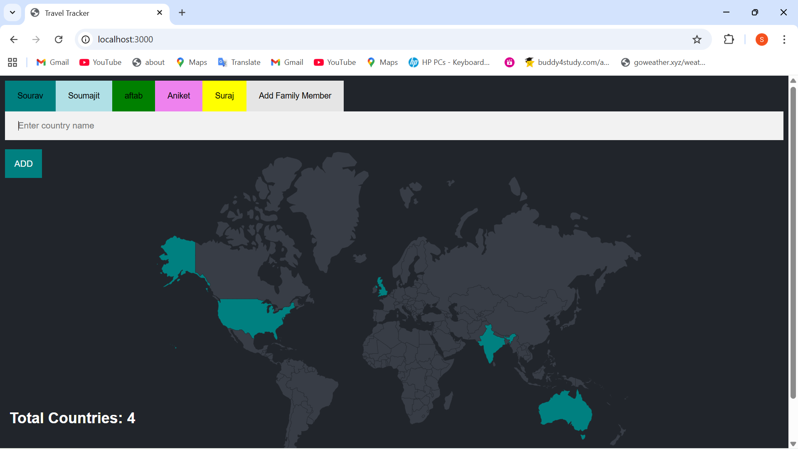
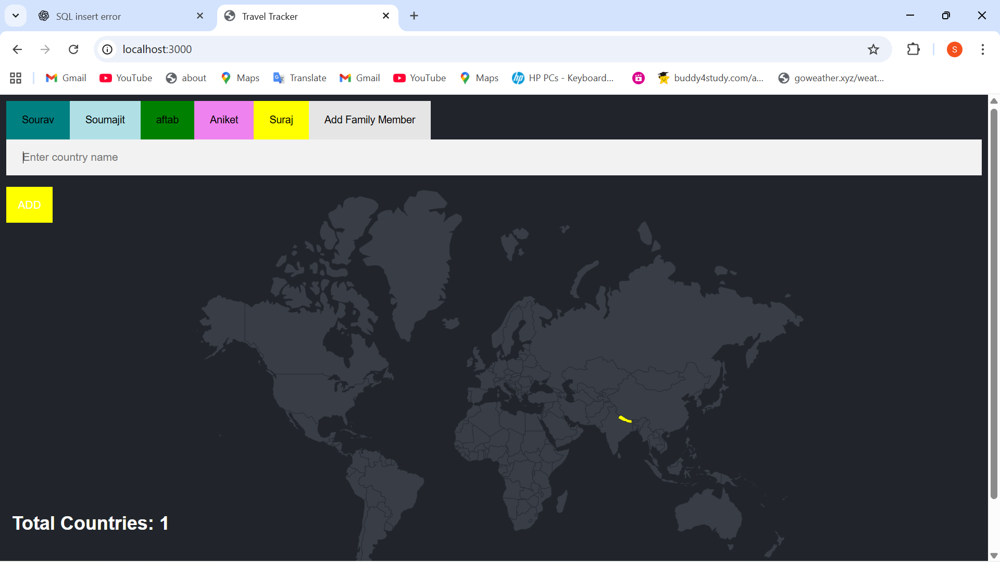
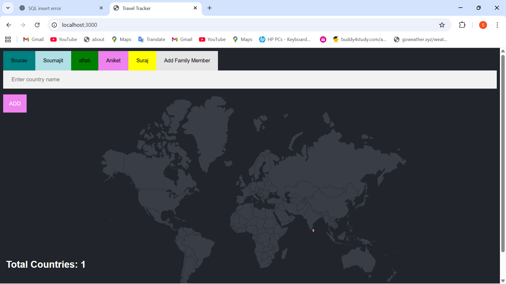

# 🌍 Family Travel Tracker

The **Family Travel Tracker** is a fun and interactive web application that helps you and your family keep track of all the countries you've visited.  
Each family member has their own profile and a personalized world map with the countries they’ve explored highlighted.

---

## ✨ Features

- **Add New Family Members**  
  Create profiles for each member of your family.

- **Track Visited Countries**  
  Record the countries each person has visited.

- **Interactive World Map**  
  Each member’s map highlights their visited countries.

- **Shared & Individual Views**  
  View travel history for one member or see a combined family map.

- **Persistent Data**  
  All records are stored so you can revisit them anytime.

---

## 🛠️ Tech Stack

- **Frontend:** HTML, CSS, JavaScript
- **Backend:** Node.js and  Express 
- **Database:** MySQL , PostgreSQL 
- **Other Tools:** REST APIs, JSON

---

## 📸 Screenshots

---

## 👨‍💻 Author

**Sourav Sharma**  
💌 Email: souravbgp2210@gmail.com  
🌐 GitHub: [your-github-username](https://github.com/souravsharma22)  
🔗 LinkedIn: [your-linkedin-profile](https://www.linkedin.com/in/sourav-sharma-12b589297/)  

---
